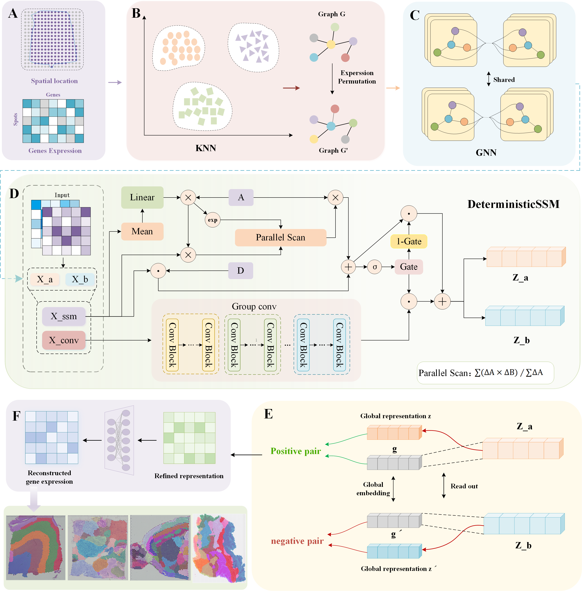

# DSSMST: Self-Supervised Spatial Domain Recognition Based on Deterministic State Space Model and Contrastive Learning

## Overview

Spatial transcriptomics (ST) has redefined our exploration of tissue-level cellular heterogeneity and spatial architecture, yet accurately pinpointing functional regions within complex, high-dimensional datasets remains a pressing computational hurdle.

**DSSMST** is a novel self-supervised framework designed to achieve robust and precise spatial domain identification. It features:

- **Graph Neural Network (GNN):** Efficiently aggregates local spatial context and neighborhood relationships by constructing spatial adjacency graphs based on physical coordinates.
- **Deterministic State Space Model (DSSM):** Overcomes the limitations of static graph models by treating spatial data as a latent sequence, capturing continuous long-range gene expression gradients and evolutionary trends.
- **Self-Supervised Contrastive Learning:** Employs a discriminator-based Deep Graph Infomax (DGI) strategy to maximize the mutual information between local patch representations and the global tissue summary, refining the latent embedding space without manual annotations.

DSSMST consistently achieves state-of-the-art performance across diverse datasets, including human DLPFC (10x Visium), human breast cancer, colorectal cancer, mouse forebrain, and head and neck angiosarcoma.



## Installation

We recommend using [Conda](https://docs.conda.io/en/latest/) to manage your environment. DSSMST is implemented in Python and relies on PyTorch, Scanpy, and Mamba-ssm.

```python
# 1. Clone the repository
git clone https://github.com/JiruiZhang/DSSMST.git
cd DSSMST

# 2. Create a conda environment
conda create -n dssmst_env python=3.9
conda activate dssmst_env

# 3. Install PyTorch (matching CUDA 12.1 as per your environment)
pip install torch==2.1.0 torchvision==0.16.0 torchaudio==2.1.0 --index-url https://download.pytorch.org/whl/cu121

# 4. Install PyTorch Geometric and its dependencies
pip install torch_geometric==2.6.1
# Install PyG related dependencies matching torch 2.1.0 + cu121
pip install torch_scatter torch_sparse torch_cluster torch_spline_conv -f https://data.pyg.org/whl/torch-2.1.0+cu121.html

# 5. Install specific dependencies for State Space Models (DSSM)
pip install mamba-ssm==2.2.3 einops hilbertcurve
```

# Requirements

Python == 3.9，
Torch == 2.1.0，
Scanpy == 1.10.3，
Anndata == 0.10.9，
Mamba-ssm == 2.2.3，
Torch_geometric == 2.6.1，
NumPy == 1.24.4，
Rpy2 == 3.4.1，
Matplotlib == 3.7.2，
Tqdm == 4.64.1，
Scikit-learn == 1.6.1，
R == 4.2.0

## Tutorial

A Jupyter Notebook of the tutorial is accessible from :

https://github.com/JiruiZhang/MIST/blob/main/DSSMST/DLPFC.ipynb
